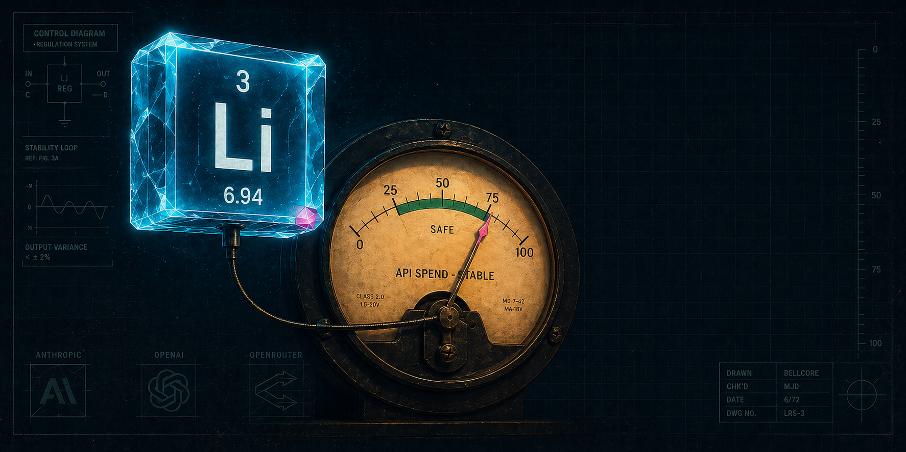

<p align="center">
  
</p>

<h1 align="center">lithium</h1>

<p align="center">
  <em>Mood stabilizer for your AI bill.</em><br>
  One number, every provider, no spreadsheet.
</p>

<p align="center">
  <strong>Status:</strong> Phase 1 build in progress. Spec at <a href="docs/SPEC-PHASE-1.md"><code>docs/SPEC-PHASE-1.md</code></a>. v0.1.0 ships when <code>lithium today</code> and <code>lithium month</code> return correct numbers from a fresh install. Watch / star to know when.
</p>

<p align="center">
  
  
  
  
  
</p>

---

<p align="center">
  
</p>

## What

You use Anthropic. You also use OpenAI. And OpenRouter. Maybe a local model. At the end of the month you have no idea what you spent. Each provider has its own dashboard, none of them talk to each other, and you've been doing the math in a spreadsheet, badly.

`lithium` is a tiny local daemon that polls every provider you use, normalizes the numbers into one SQLite database, and answers exactly one question:

> **How much am I actually spending on LLMs this month, across everything, fixed and variable?**

That's the whole product. No web dashboard, no SaaS, no telemetry, no analytics. The data lives on your machine. The CLI prints the answer.

## Why

Three things go wrong when you run agents across multiple providers:

1. **You don't notice runaway cost until the bill arrives.** A misconfigured Whetstone wave or a forgotten cron can burn $200 in a day before you check.
2. **Fixed costs (Max plans, monthly subscriptions) and variable costs (per-token API) live in different mental buckets.** Most operators only track one. Both add up.
3. **Cross-provider visibility is nobody's job.** Anthropic shows you Anthropic. OpenAI shows you OpenAI. The aggregate is your problem.

`lithium` makes it the daemon's problem.

## Features (Phase 1)

| Feature | Description |
|---|---|
| **`lithium today`** | Today's spend, by source, with totals |
| **`lithium month`** | Month-to-date + projected end-of-month |
| **`lithium adapters`** | List configured providers + last-poll status |
| **`lithium config`** | Edit `~/.config/lithium/config.toml` in `$EDITOR` |
| **`lithium doctor`** | Verify config + connectivity + DB health |
| **Anthropic Admin API** | Direct API spend per model (admin key required) |
| **Claude Code session reader** | Session + weekly limit usage with reset timestamps |
| **SQLite storage** | All data local at `~/.local/share/lithium/usage.db` |
| **No telemetry** | Nothing leaves your machine. Period. |

## Quick Start

```bash
# 1. Install
cargo install --git https://github.com/shawnpetros/lithium

# 2. Generate an Anthropic admin key
# console.anthropic.com -> Settings -> Admin Keys -> Create Admin Key

# 3. Initialize config
lithium config

# Edit the file, paste your admin key under [providers.anthropic]

# 4. Initialize storage
lithium init

# 5. Pull today's data
lithium poll

# 6. Look at it
lithium today
```

Output looks like:

```
lithium - 2026-04-27

Anthropic
  API direct           $4.21    (claude-sonnet-4-6: $3.80, claude-haiku-4-5: $0.41)
  Claude Code session  47% used  (resets in 1h 12m)
  Claude Code weekly   23% used  (resets in 4d 2h)

Total today: $4.21
```

## How It Works

```
┌─ Provider adapters (Rust) ─────────────────────────┐
│  anthropic.rs   - Admin API + Claude Code session  │
│  openai.rs      - Admin API           [phase 2]    │
│  openrouter.rs  - /api/v1/key         [phase 2]    │
└────────────────┬───────────────────────────────────┘
                 │
                 ▼
        SQLite at ~/.local/share/lithium/usage.db
                 │
                 ▼
   ┌─────────────┼─────────────┬──────────┬─────────┐
   ▼             ▼             ▼          ▼         ▼
  CLI         cship         SwiftBar   OpenClaw    Web
 today/      status         menubar    MCP tool   dashboard
 month       line                      + hooks    [phase 4]
            [phase 3]      [phase 3]   [phase 4]
```

Phase 1 ships only the CLI. Each subsequent phase adds one surface, polished to the same standard before the next one starts.

## Roadmap

| Phase | Scope | Status |
|---|---|---|
| **P1** | Anthropic adapter + CLI surface | In progress |
| **P2** | OpenAI + OpenRouter adapters | Not started |
| **P3** | Daemon split + `cship` segment + SwiftBar menubar | Not started |
| **P4** | OpenClaw MCP hooks (cost gates) + optional web dashboard | Not started |

The discipline: each phase ships at finished quality before the next one starts. No half-built surface in `main`.

## Privacy

`lithium` runs entirely on your machine. No analytics, no telemetry, no phoning home. The only network calls go directly to provider APIs (Anthropic, OpenAI, OpenRouter) using the admin keys you provide. Source is auditable; if you find a single egress that isn't to a provider you configured, open an issue and call it out.

## Tech Stack

- **Rust** for the daemon and CLI
- **SQLite** for storage (via `rusqlite`)
- **Reqwest** for provider API calls
- **Tracing** for structured logs
- **Clap** for the CLI
- **Tokio** runtime

## Contributing

`lithium` is built in the open as a santifer-discipline project: each phase ships at finished public-portfolio quality before the next one is started. Issues, PRs, and adapter contributions for additional providers welcome. Adapter contract is documented in `docs/ADAPTER-CONTRACT.md` (added in Phase 2).

## License

MIT. See `LICENSE`.

## Author

Built by [Shawn Petros](https://github.com/shawnpetros) ([petrosindustries.com](https://petrosindustries.com)).

---

<p align="center"><sub>Named after the periodic-table element and the mood stabilizer. Both stop runaway.</sub></p>
